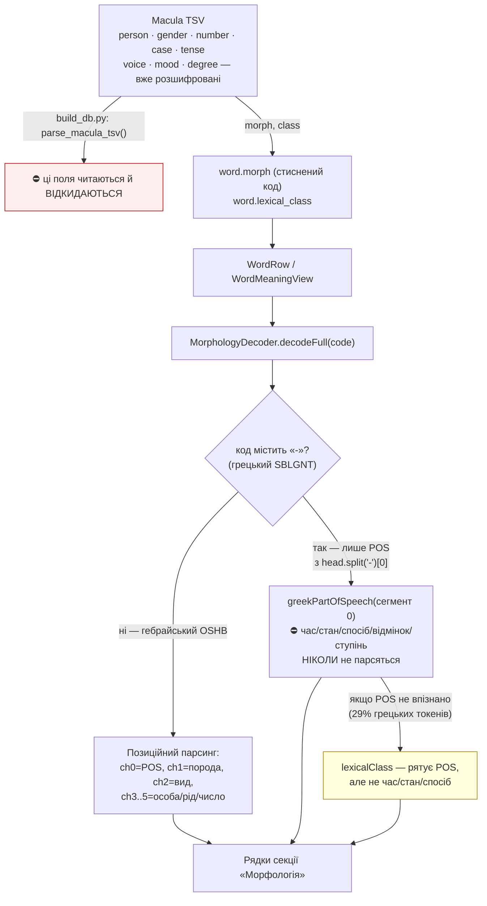
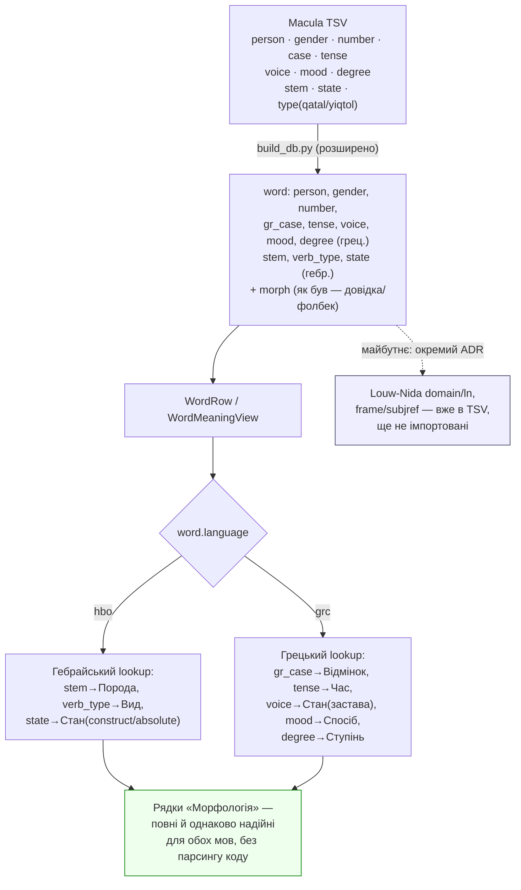

# ADR-040: Морфологічний декодер — розшифровані поля з джерела замість парсингу стисненого коду

**Status:** Accepted (2026-09-05) — Варіант B, з перезбіркою бази
**Date:** 2026-09-05
**Deciders:** Іван
**Пов'язані:** ADR-033 (лексикон: порода форми, а не діапазон кореня), ADR-036 (український шар глос), ADR-028 (версифікація), ADR-034 (зняття розмітки — action item #2 чекає саме на цю перезбірку), `docs/db_build.md`, `docs/original-tab.md`, bug-053

**Amendment 2026-09-05:** база `sourcebible.db` не перезбиралась з 2026-08-07 —
цей ADR і так вимагає повного `./rebuild.sh`, тож у той самий прогін увійде
накопичений борг: ADR-034 item #2 (`text_clean`, `_search_text()` виправлено
2026-08-07/08, у базу не потрапило), `build_db.py` сам змінювався 2026-08-09
(коміт `2b6028d`) без наступної перезбірки, і курація 147 гліс bug-051
(2026-08-26, `curated-glosses.tsv` — код готовий і звірений, застосувати не
встигли). Деталі — окремим повідомленням Івану, не тут.

---

## Контекст

### Як дійшли до цього рішення

Готуючись до групи, Іван відкрив Рим. 6:14 (κυριεύσει, «гріх не пануватиме над
вами») і помітив: підрядник коректно показує майбутній час («will rule over»), а
панель «Морфологія» — ні (жодного часу), і до того ж показує «Основа (Біньян): -»
для грецького слова, хоча Біньян — суто гебрайська категорія.

Розслідування (`/debug`, 2026-09-05) знайшло й виправило в тому ж сеансі:

1. **Баг «Основа (Біньян): -».** `decodeFull()` парсив ЛЮБИЙ код позиційно як
   гебрайський OSHB, не перевіряючи дефіс. Для грецького `"V-FAI-3S"` другий символ
   рядка — сам роздільник `-` — підставлявся в `hebrewStem()`, чия `default`-гілка
   повертає `String(c)`, тобто той самий дефіс. Це не заглушка «немає даних» — це
   роздільник коду, помилково прочитаний як гебрайська літера породи.
2. **Регресія, знайдена й виправлена одразу.** Після (1) `decodeFull` для грецької
   визначав ЛИШЕ частину мови через новий `greekPartOfSpeech()` — і повертав `nil`
   (ховаючи всю секцію «Морфологія»), якщо код не впізнавався. Виміряно: це **29,4%
   усіх грецьких токенів НЗ** (40 438 з 137 779), включно з артиклем `T` (19 783
   вживання — найчастіше слово в грецькому НЗ). Виправлено тим, що додано м'який
   фолбек на `lexicalClass` (як це вже було в короткому шляху decode()).
3. **bug-053** (заведено окремо): `decodeGreek()`/`greekPartOfSpeech()` самі по собі
   лишаються неповним (8 з 21 реального POS-префікса) і місцями неправильним
   (код `"P"` підписаний як «Прийменник», хоча в даних це особовий займенник)
   джерелом правди — сьогодні не видно користувачу лише тому, що `lexicalClass`
   завжди рятує ситуацію вище по ланцюжку виклику.

Три різні баги за один день з одного й того самого класу коду — сигнал, що
проблема не в трьох окремих недогляданнях, а в самому підході.

### Головна знахідка: дані вже розшифровані в джерелі — ми викидаємо їх на етапі збірки

`scripts/build_db.py` (`parse_macula_tsv`) читає з Macula TSV лише
`text/lemma/morph/english|gloss/strong/class/normalized/transliteration` і формує
рядок `word` із **стисненим** кодом `morph` (напр. `"V-FAI-3S"`, `"VNp3cp"`).
Але сирий TSV для цього самого слова вже містить (перевірено прямим читанням
`data/macula-greek-main.zip` і `data/macula-hebrew-main.zip`):

**Грецька (`macula-greek-Nestle1904.tsv`, приклад — Рим 6:14 κυριεύσει):**

| колонка TSV | значення | сьогодні в БД? |
|---|---|---|
| `morph` | `V-FAI-3S` | ✅ (єдине, що йде далі) |
| `class` | `verb` | ✅ (як `lexical_class`) |
| `person` | `third` | ❌ відкинуто |
| `number` | `singular` | ❌ відкинуто |
| `tense` | `future` | ❌ відкинуто |
| `voice` | `active` | ❌ відкинуто |
| `mood` | `indicative` | ❌ відкинуто |
| `case`, `degree` | (для інших слів: `nominative`, `accusative`…) | ❌ відкинуто |
| `domain`, `ln` | `088015` / `88.118` (Louw-Nida семантичний домен) | ❌ відкинуто |
| `frame`, `subjref`, `referent` | `A0:n45006014001` (семантична роль — хто що кому робить) | ❌ відкинуто |

**Гебрайська (`macula-hebrew.tsv`, приклад — Ос. 4:6 נִדְמוּ):**

| колонка TSV | значення | сьогодні в БД? |
|---|---|---|
| `morph` | `VNp3cp` | ✅ |
| `stem` | `niphal` | ❌ відкинуто (у Swift це реконструюється з `ch[1]` коду) |
| `pos` | `verb` | ✅ (частково — через `class`) |
| `type` | `qatal` | ❌ відкинуто (у Swift — `hebrewAspect(ch[2])` → «Perfect») |
| `person`/`gender`/`number` | `third`/`common`/`plural` | ❌ відкинуто (реконструюється з `ch[3..5]`) |
| `state` | (для іменників: `construct`/`absolute`) | ❌ відкинуто |
| `lexdomain`/`contextualdomain`/`coredomain`/`sdbh` | семантичні домени | ❌ відкинуто |
| `frame`/`subjref`/`participantref` | семантична роль | ❌ відкинуто |

Тобто **поточна архітектура — це Swift-парсер, що на льоту РЕКОНСТРУЮЄ**
(посимвольним розбором стисненого коду) те, що джерельний датасет уже видав нам
**розшифрованим англійськими словами**. Кожен із трьох багів цієї сесії — прямий
наслідок цієї реконструкції: дефіс, прийнятий за літеру породи; POS-перемикач,
що не встигає за реальним переліком префіксів; невідповідність між коротким і
повним декодером (див. нижче, Ос. 4:6 — порода Poel).

### Поточна архітектура (як є)

### Дрібніша, але та сама хвороба: Poel у короткому підписі слова

`decodeHebrew()` (короткий підпис у списку слів) не має кейсу `"D"` (Poel) у
своєму switch породи дієслова — лише `q,N,p,P,h,H,t`. `hebrewStem()` (повна
панель) кейс `"D"` МАЄ. Виміряно: 3 вживання в усій Біблії (`VDq…`, `VDp…`).
Наслідок мізерний (3 слова показують «Дієслово» без назви породи в списку, хоча
в детальній панелі порода є) — але це той самий клас багу: два незалежні місця,
що повинні знати одну й ту саму таблицю кодів, тихо розійшлись.

### Що це означає для самого Рим. 6:14

Іван шукав час (майбутній) — і мав рацію, що це важливо. Але дослідження джерела
показало щось важливіше для його богословського питання «це наказ чи твердження
факту»: **`mood: indicative`**. У грецькій дійсний спосіб (indicative) стверджує
факт; наказовий спосіб (imperative) наказує. κυριεύσει стоїть у дійсному способі
майбутнього часу — граматично це твердження-обіцянка («гріх НЕ БУДЕ панувати»),
а не наказ («хай не панує»). Сьогодні застосунок не показує **спосіб** для жодного
грецького дієслова — це, найімовірніше, точніша відповідь на «наказ чи обіцянка»,
ніж сам час. Louw-Nida домен цього слова (37 — «Control», за назвою семантичного
домену в лексиконі Louw-Nida) також уже лежить у джерелі й теж не використовується.

### Рецензія Opus (2026-09-05): виміряні уточнення й нові знахідки

Перед стартом реалізації рішення пройшло адверсаріальну рецензію (модель Opus,
пряма перевірка проти репозиторію, TSV-джерел і обох копій бази — не з
пам'яті). Підтвердила напрям (Варіант B) і саму потребу відмовитись від
позиційного парсингу, але знайшла п'ять фактичних помилок у первинному
аудиті, дві з яких важливіші за баг, з якого все почалось:

1. **Найбільший знайдений баг.** Гебрайський символ `morph[2]` = `c`
   (**infinitive construct, 6 606 слів**) застосунок зараз підписує
   «Когортатив». `q` (weqatal, 5 666 слів) і `h` (cohortative, 574) взагалі
   не мають кейсу в `hebrewAspect()` і показують порожньо. Це на три порядки
   більше за Poel-розбіжність (3 слова), яку первинний аудит виніс окремим
   розділом — доказ, що метод «перечитати switch + перевірити кілька віршів»
   недостатній (див. «Обсяг реалізації», крок «Корпусний диференціал»).
2. **`mood` у Macula — це не лише спосіб.** Значення: indicative 15 617,
   **participle 6 653**, **infinitive 2 285**, imperative 1 877,
   subjunctive 1 856, optative 69. Показувати «Спосіб: дієприкметник» —
   граматично неправильно. Поле розділяється на два UI-рядки: «Спосіб»
   (тільки 4 справжні способи) і «Форма» (participle/infinitive). Edge-case
   «дієприкметник» нижче виправлено відповідно.
3. **`voice` має 5 значень, не 3**: додається `middlepassive` (1 714).
4. **Грецький код лишається джерелом правди для підтипу POS** — виправляє
   помилкове формулювання «жодного позиційного парсингу не лишається».
   `class`/`type` НЕ розрізняють зворотний (`F`, ἑαυτοῦ, 410), взаємний
   (`C`, ἀλλήλων, 100) і особовий (`P`, 11 006) займенники — усі три мають
   однаковий `class='pron'`. Тому bug-053 не закривається автоматично
   видаленням `greekPartOfSpeech()`: замінюється не на нуль, а на **пласку
   мапу всіх 21 виміряного префікса** (без посимвольного розбору сегментів —
   сама причина крихкості зникає, підтип не втрачається).
5. **Гебрайська колонка `type` — не про дієслова.** Значення: `common`
   110 120, `pronominal` 45 607, `proper` 33 966, `definite article` 31 191,
   `direct object marker` 11 019, `negative` 6 884, `gentilic` 1 785 — і, для
   дієслів, `qatal`/`yiqtol`/`wayyiqtol`/… Назва колонки в БД → `morph_type`
   (не `verb_type`, як було нижче в первинному плані — та назва мала або
   приховати ці дані, або збрехати іменем). У UI («Форма») в межах цього ADR
   показуємо лише дієслівні значення; іменникові/займенникові підтипи
   (`common`/`proper`/…) імпортуються (та сама колонка, дешево), але в UI v1
   не виводяться — недостатньо цінності для богословського читання, можна
   додати пізніше без нової збірки.
6. **Додатково імпортувати:** грецьку `type` (`gr_type` —
   common/proper/demonstrative/relative/interrogative/indefinite/possessive
   — частково закриває bug-053 для підтипів займенника), гебрайську `pos`
   (значення `suffix`, 47 442 — заміняє парсинг префікса `"S"` для пошуку
   голови слота в `headIndex()`) і `lang` (`H`/`A` — 7 549 арамейських
   токенів зараз показані як гебрайські, Дан. 2–7 / Езд. 4–7).
7. **Сентинели «unknown».** `person='unknown: x'` — 2 676 рядків,
   `stem='unknown:*'` — 106, ще по 7 для `type`/`gender`/`number`. Наївний
   lookup надрукував би користувачу літеральне «unknown: x» — потрібне
   окреме правило: значення, що починається з `unknown`, не показувати
   рядком, і гейт у білді, що рахує їх.
8. **Гейт «структуроване поле порожнє, а код ні» — уже виміряно, = 0**
   (0 з 28 357 грец. дієслів; 0 з 73 688 гебр. дієслів). Фолбек на `morph`
   при порожньому структурованому полі прибирається з обсягу як мертва
   гілка — саме мертві гілки в цьому файлі коштували чотирьох багів цієї
   сесії.
9. **Побічний ефект в ADR-033.** `canonicalHebrewStem()` після цього ADR
   почне розпізнавати 34 породи замість 8 — ранжування BDB, яке досі мовчало
   на невідомих породах, почне спрацьовувати для них. Плюс незалежно
   знайдений існуючий баг: для складеного гебрайського слота (`C·Vqp3ms`)
   функція отримує СКЛЕЄНИЙ код, перший символ — `C`, і мовчки повертає
   `nil` — ранжування ADR-033 для складених слотів не працює вже зараз.
   Обидва — в обсязі цього ж тікета (не новий ADR, бо причина та сама).
10. **Об'єднання одного `rebuild.sh` для всіх боргів — переглянуто.**
    bug-051 виявився вже застосованим до РОБОЧОЇ бази (26.08), але не до
    бандла — прогін 26.08 мовчки не дійшов до фінального копіювання, і це
    10 днів ніхто не помітив. Аргумент ЗА покроковість, не за один змішаний
    прогін — див. розділ про rebuild у «Обсяг реалізації».

## Рішення

**Твоя інтуїція (ділити на іврит/грецьку одразу) — правильна, але сама по собі
недостатня.** Якщо просто розділити `decodeFull` на дві гілки (як зроблено
точково зараз) і далі парсити стиснений код позиційно — але вже окремо для
кожної мови — це прибирає плутанину між мовами, але **залишає корінь усіх трьох
багів на місці**: Swift і далі вгадує граматику по позиції символу в рядку, і
щоразу, коли Macula видасть форму з іншою розкладкою сегмента (дієприкметник:
відмінок+рід+число замість особи; інфінітив: без особи й числа взагалі —
див. Edge cases нижче), розбір мовчки поламається так само, як зараз.

**Пропоноване рішення: перестати парсити стиснений код у Swift. Імпортувати вже
розшифровані поля з TSV як окремі колонки `word` під час збірки бази.**
Розділення на іврит/грецьку відбувається природно й майже безкоштовно — бо самі
поля різні (відмінок/ступінь/спосіб/застава існують лише в грецькій; порода й
стан construct/absolute — лише в гебрайській), а не тому, що ми штучно розводимо
одну й ту саму позиційну логіку на дві копії.

### Нові колонки `word` (розширення, не нова таблиця — див. Варіант C нижче)

| колонка | мова | приклад значення | джерело TSV |
|---|---|---|---|
| `person` | обидві | `third` | Greek `person` / Hebrew `person` |
| `gender` | обидві | `feminine` | `gender` |
| `number` | обидві | `singular` | `number` |
| `gr_case` | грецька | `nominative` | Greek `case` |
| `tense` | грецька | `future` | Greek `tense` |
| `voice` | грецька | `active` | Greek `voice` |
| `mood` | грецька | `indicative` / `participle` / `infinitive` | Greek `mood` (UI розводить на «Спосіб» і «Форму» — див. рецензію Opus вище) |
| `degree` | грецька | (comparative/superlative) | Greek `degree` |
| `gr_type` | грецька | `demonstrative` | Greek `type` (додано рецензією Opus — підтип займенника/означення, частково закриває bug-053) |
| `stem` | гебрайська | `niphal` | Hebrew `stem` |
| `morph_type` | гебрайська | `qatal` (дієслово) / `common` (ім.) | Hebrew `type` — перейменовано з `verb_type`: колонка не лише про дієслова (додано рецензією Opus) |
| `state` | гебрайська | `construct` | Hebrew `state` |
| `pos` | гебрайська | `suffix` | Hebrew `pos` (додано рецензією Opus — заміняє парсинг префікса `"S"` у `headIndex()`) |
| `lang` | гебрайська | `A` (арамейська) | Hebrew `lang` (додано рецензією Opus — 7 549 арамейських токенів зараз показані як гебрайські) |

`morph` (стиснений код) **лишається** — як був — для звірки/діагностики.
Фолбек «структуроване поле порожнє, а код — ні» в обсяг НЕ входить: виміряно
рецензією Opus = 0 випадків (див. вище).

### Гебрайський lookup: один механізм (колонки), не два

Рецензія Opus запропонувала альтернативу для гебрайської: окрема таблиця-
довідник `код → поля` замість колонок на кожному слові, бо `(morph, lang) →
поля` для гебрайської — ідеальна функція без винятків (892 унікальні пари на
469 476 слів, 0 колізій). Для грецької це неможливо: код там **лоссі**
(`N-PRI` сам по собі, 773 вживання, ховає 16 різних комбінацій відмінок/рід/
число).

**Рішення (Іван, 2026-09-05) — оптимальна архітектура: один механізм для
обох мов.** Лишаємо колонки на `word` для ОБОХ мов, як у первинному
Варіанті B. Два різні механізми lookup (таблиця для івриту, колонки для
грецької) означали б два незалежні місця, що мають знати одну семантику, —
точно те, що спричинило три баги цієї сесії (короткий і повний декодер
розійшлись). Один механізм важливіший за 10-13 МБ економії, яку дала б
окрема таблиця для івриту.

Береться лише та частина пропозиції Opus, що не додає другого механізму:
build-крок ДОДАТКОВО генерує `data/morph_decode_hebrew.tsv` (892 рядки,
`код+lang → всі поля`) як git-версійований **артефакт звірки** — не
рантайм-шлях, не джерело для Swift, лише файл, який можна прочитати очима
чи продифити між збірками. Для грецької такий файл сенсу не має (код
лоссі, не ключ).

`MorphologyDecoder` перестає бути парсером і стає **тонким lookup-шаром
локалізації**: бере вже готове англійське слово з колонки (`"future"`,
`"niphal"`, `"construct"`) і повертає український підпис зі словника
(`MorphKey`). Українська термінологія — окреме рішення нижче.

### Термінологія (потребує підпису Івана — не спеціаліст, тож пропоную звичні варіанти)

**Затверджено Іваном 2026-09-05:**

| поле | укр. назва (затверджено) | нотатка |
|---|---|---|
| `case` (грец.) | Відмінок | 5 значень: називний/родовий/давальний/знахідний/кличний — ГРЕЦЬКИЙ перелік, без натяку на відповідність укр. 7 відмінкам (не 1:1: укр. давальний+орудний+місцевий не мають окремих грецьких відповідників). Англ. UI: стандартні академічні терміни Nominative/Genitive/Dative/Accusative/Vocative — звична лексика для опису граматики інших мов, як і в будь-якій англомовній граматиці грецької, попри те що сучасна англійська відмінків морфологічно не має (так само як «aorist» вживається в англ. без перекладу) |
| `tense` | Час | аорист лишається «аорист» (українського відповідника нема, не вигадувати «минулий») |
| `voice` | **Стан** (без «застава» — калька рос. «залог», не укр. термін) | 4 значення: активний/середній/пасивний/середньо-пасивний (`middlepassive`) |
| `mood` | Спосіб | ТІЛЬКИ 4 справжні способи: дійсний/наказовий/умовний/бажальний. `participle`/`infinitive` — окремий рядок **«Форма»**, не «Спосіб» (виправлено рецензією Opus, див. вище) |
| `degree` | **Ступінь порівняння** | звичайний ступінь рядком НЕ показується (дефолт, не інформація); вищий/найвищий — показуються |
| `morph_type` (гебр., було `verb_type`) | **Форма** | для дієслів: перфект/імперфект (звична термінологія застосунку) + wayyiqtol НЕ згортається в імперфект (14 978 вживань, окремий ключ `aspectWayyiqtol` уже існує — зберегти). Не-дієслівні значення (`common`/`proper`/`pronominal`/…) імпортуються, у UI v1 не показуються |

## Варіанти

### Варіант A: розділити `decodeFull` за мовою, лишити парсинг коду (мінімальний)

| | |
|---|---|
| Складність | Низька — тільки Swift, без міграції бази |
| Чи усуває корінь багів | Ні — так само вгадує позицію символу, просто окремо для кожної мови |
| Вартість | ~1 день |

**Плюси:** швидко, без rebuild бази.
**Мінуси:** для грецьких TVM-сегментів («FAI», «3S») довелось би вручну
захардкодити позиційні таблиці ще й для дієприкметників (відмінок+рід+число
замість особи), інфінітивів (без особи/числа), імперативів (лише 2-3 особа) —
кожна нова форма = нова ручна таблиця й новий шанс повторити сьогоднішній баг.
Не відкриває Louw-Nida/frame. Не пояснює, чому взагалі три баги за один день —
просто відкладає наступний.

**Уточнення рецензії Opus (2026-09-05): для частини форм цей варіант не
просто крихкий — він НЕМОЖЛИВИЙ у принципі.** Грецький код `N-PRI`
(773 вживання) фізично не містить відмінка/роду/числа: одна й та сама пара
сегментів відповідає 16 різним комбінаціям — жодна позиційна таблиця це не
відновить. Гебрайський символ породи неоднозначний без колонки `lang`
(7 549 арамейських токенів у корпусі): Swift не може розрізнити `q`=qal від
`q`=peal (арам.), бо `lang` у БД взагалі не читається.

### Варіант B (рекомендовано): імпортувати розшифровані поля з TSV, декодер = lookup

| | |
|---|---|
| Складність | Середня-висока — `build_db.py` + схема + `MorphologyDecoder` + локалізаційні ключі + словник термінології (~118 значень) |
| Чи усуває корінь багів | Так, для граматичних полів; POS-підтип лишається джерелом з `morph`-префікса, але як пласка мапа, не позиційний розбір |
| Вартість | **5-9 днів** (уточнено рецензією Opus 2026-09-05, було ~2-3 — недооцінка через обсяг термінології) + 2 прогони `./rebuild.sh` (~10 хв кожен) |

**Плюси:** усуває клас багів, а не окремі його прояви; дешево відкриває шлях до
Louw-Nida/frame (колонки вже читатимуться з того самого TSV-рядка, лишається
додати ще кілька `INSERT`-полів — не в межах цього ADR, але інфраструктура готова);
відповідає власному принципу проєкту «Дані перед висновком» — джерело вже дало
відповідь, ми її просто не брали.
**Мінуси:** вимагає rebuild бази й перевірки, що існуючі user-data (highlights,
bookmarks) не прив'язані до чогось, що схема зачіпає (не мають бути — `word.id`
не міняється); трохи більший diff.

### Варіант C: окрема таблиця `word_morphology` замість розширення `word`

Розглянуто й відхилено. `word` уже має мовно-специфічні nullable колонки як
прецедент (`slot`, `xlit_slot`, `greek`, `greek_strong` — NULL для іншої мови),
тож нові nullable колонки не порушують усталений патерн. Окрема таблиця означала
б JOIN на кожному відкритті детальної панелі слова заради даних, які й так
завжди читаються разом із рядком `word` — зайва сутність без виграшу.

## Наслідки

**+** Усуває корінь трьох багів цієї сесії одним рішенням, а не трьома патчами.
**+** Показує Спосіб (Mood) — граматично точнішу відповідь на питання Івана
«наказ чи обіцянка», ніж сам час.
**+** Відкриває (не реалізує) шлях до Louw-Nida доменів і семантичних ролей
(`frame`/`subjref`) — окрема майбутня фіча/ADR, не частина цього рішення.
**+** Мова іврит/грецька розділяється природно, за формою даних, а не штучною
розгалуженістю в одному Swift-файлі.
**−** Потрібен rebuild бази й ретельна звірка перед реалізацією (див. нижче).
**−** Термінологічне рішення (застава/стан, час/вид) потребує підпису Івана —
неспеціаліст, і це нормально, але хтось має вирішити один раз.
**−** Не закриває bug-053 автоматично — той тікет буде розв'язано ЯК ЧАСТИНА
реалізації цього ADR (стиснений код більше не буде єдиним джерелом POS), але
техніку варто описати саме в тікеті реалізації, не тут.

## ⛔ Edge cases — кожен має бути покритий перед реалізацією

| випадок | що зробити |
|---|---|
| Дієприкметник (participle, 6 653) і інфінітив (2 285) — грецькі, лежать у полі `mood`, НЕ в «Спосіб» | **Виправлено рецензією Opus:** окремий рядок «Форма» (не «Спосіб»); для participle TSV дає відмінок/рід/число прямо в `case`/`gender`/`number` — спецлогіка потрібна лише для розведення `mood`→{Спосіб, Форма} |
| Гебрайський інфінітив/дієприслівник — без особи/роду/числа | Поля просто порожні в TSV → показуємо лише наявні рядки |
| Структуроване поле порожнє, а `morph`-код — ні | **Виміряно рецензією Opus: = 0** (0 з 28 357 грец. дієслів, 0 з 73 688 гебр. дієслів). Фолбек на `morph` НЕ реалізується — мертва гілка, прибрана з обсягу |
| Сентинели `unknown:*` (2 789 рядків: person 2 676, stem 106, type/gender/number по 7) | Значення, що починається з `unknown`, не показувати рядком; гейт у білді рахує їх і падає при зростанні |
| Складене слово (кілька токенів на один `slot`, гебрайська) | Розбираємо ГОЛОВУ (як і зараз, `headMorpheme`) — нові поля так само читаються з рядка голови. **Знайдено побічно (Opus):** `canonicalHebrewStem()` (ADR-033) отримує СКЛЕЄНИЙ код (`C·Vqp3ms`) і мовчки повертає `nil` для складених слотів — існуючий баг, не новий; фіксується в межах цього ж тікета |
| Депонентне дієслово (voice='middle'/'middlepassive', переклад активний) | Показуємо `voice` як є — точніше за нинішній стан (взагалі нічого) |
| Poel (`stem='poel'`, код `m`, 76 вживань) та інші рідкісні породи | **Виправлено рецензією Opus:** `D`=nithpael, не Poel; `m`=poel. Один спільний lookup для короткого й повного підпису — розбіжність структурно неможлива |
| Грецькі підтипи займенників (`F` зворотний/`C` взаємний/`P` особовий — усі `class='pron'`) | `class`/`type` їх НЕ розрізняють — джерело правди лишається пласка мапа 21 префікса `morph` (не позиційний розбір сегментів) |

## Верифікація (після реалізації)

- Рим. 6:14 κυριεύσει → Частина мови: Дієслово · Час: майбутній · Стан: активний ·
  Спосіб: дійсний · Особа: 3 · Число: однина. Жодного «-» замість Основи.
- τὸν (артикль, `T-ASM`) → Частина мови: Артикль (сьогодні: секція взагалі
  ховається до фіксу-регресії 2026-09-05; після ADR — стабільно, не через
  lexicalClass-фолбек, а напряму).
- Ос. 4:6 נִדְמוּ → Порода: Ніфаль (як і зараз, ADR-033), Вид: перфект/qatal —
  однаково і в короткому, і в повному підписі.
- Дієприкметник (напр. будь-який `V-PAP-*`) → Відмінок/Рід/Число замість
  Особи, без спецкоду.
- **Потрібне візуальне QA на пристрої/симуляторі** (той самий застережний
  рядок, що й в ADR-033, — керувати симулятором наживо із сесії агента не
  вдається; збірка зелена й дані звірені напряму із БД, але візуально не
  перевірено).

## Обсяг реалізації (для тікета реалізації, оновлено рецензією Opus 2026-09-05)

0. **Rollback perimeter (перед будь-яким прогоном):** скопіювати чинний бандл
   `SourceBible/Resources/sourcebible.db` → `sourcebible-backup.db`; `git tag`
   перед першим комітом. Кореневу `sourcebible.db` як точку відкату НЕ
   використовувати — вона зараз гібрид збірки 07.08 і часткового прогону
   26.08.
1. ~~Виміряти: скільки рядків мають `morph`, але порожнє структуроване поле~~ —
   **виконано рецензією Opus: = 0.** Прибрано з обсягу, фолбек не
   реалізується.
2. **Прогін 1 (без схемних змін):** ADR-034 item #2 + `build_db.py`-борг +
   довести bug-051 до бандла (147 глос уже в робочій базі з 26.08, бракує
   лише фінального копіювання). Заздалегідь зафіксувати очікуваний діф проти
   БАНДЛА 07.08 (не проти кореневої — вона забруднена): `gloss_display` +147;
   `verse.text_clean` (сьогодні 7 951 вірш містить `[`); перебудова
   `verse_fts`/`search_terms`. Будь-яка інша таблиця, що зрушила, — стоп і
   розслідування. Найбільший радіус ураження в усьому пакеті (пошук,
   крос-рефи, паралельні, картки закладок, снапшоти нотаток) — тому
   верифікується ОКРЕМО від морфології.
3. **Прогін 2 (схема + колонки морфології):** `scripts/build_db.py` —
   розширити `parse_macula_tsv` новими колонками (`person, gender, number,
   gr_case, tense, voice, mood, degree, gr_type` — грецька; `stem,
   morph_type, state, pos, lang` — гебрайська); міграція схеми `word`;
   правило для `unknown:*`-сентинелів; build-гейт (Python, Swift-тестового
   таргету немає): усі гебр. дієслова мають непорожні `stem`/`morph_type`;
   усі грец. дієслова — `tense`/`voice`/`mood`; кількість `unknown:*` =
   зафіксованій; набір різних значень кожного поля не зростає проти
   зафіксованого списку (інакше нове значення Macula мовчки друкується
   англійською).
4. **Корпусний диференціал (найважливіший запобіжник):** згенерувати таблицю
   `код → (старий вивід декодера, новий вивід із колонок, кількість
   вживань)` для всіх 747 гебр. + 1 055 грец. кодів, відсортовану за
   вживаністю, і переглянути очима найчастіші перед тим, як вважати
   реалізацію готовою. Це єдиний крок, що ловить регресії на кшталт
   «6 606 когортативів» — точкова верифікація за окремими віршами (Рим 6:14,
   Ос. 4:6) її не бачить.
5. `MorphologyDecoder`: прибрати `hebrewStem`/`hebrewAspect`/`personLabel`/
   `genderLabel`/`numberLabel`/`stateLabel`/`decodeGreek`-позиційний розбір
   СЕГМЕНТІВ; замінити на lookup-словники за англійськими значеннями з нових
   колонок. Префікс `morph` (POS) ЛИШАЄТЬСЯ джерелом підтипу частини мови —
   як пласка мапа на всі 21 виміряний грецький префікс (не позиційний
   розбір, просто словник «рядок → підпис»).
6. Нові ключі `MorphKey` (Відмінок/Час/Стан/Спосіб/Форма/Ступінь порівняння +
   значення) — обидві мови, термінологія затверджена Іваном 2026-09-05 (див.
   таблицю вище); англ. UI — стандартні академічні терміни (Nominative/
   Genitive/… для відмінків, «aorist» без перекладу тощо).
7. `WordTabContent` / `WordMeaningView`: нові рядки в секції «Морфологія»,
   включно з окремим рядком «Форма» (participle/infinitive, відокремлено від
   «Спосіб»).
8. **ADR-033:** перевірити `canonicalHebrewStem()` після розширення до 34
   порід (зараз мовчки повертає `nil` на 26 із них); паралельно виправити
   незалежно знайдений баг — функція отримує склеєний код складеного слота
   (`C·Vqp3ms`) і завжди повертає `nil` для таких токенів.
9. Закрити bug-053: не видаленням `greekPartOfSpeech()`, а заміною
   позиційного розбору на пласку мапу 21 префікса (виправляє й `"P"` →
   особовий займенник, не прийменник).
10. Візуальне QA на симуляторі/пристрої (не виконано агентом — обмеження
    сесії).
