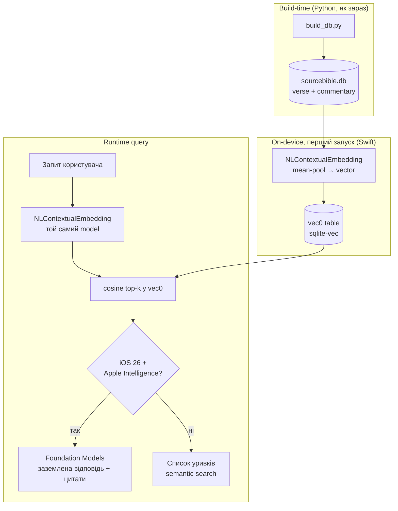

# План v1.5: Semantic Search + On-Device RAG

**Status:** Proposal (V1.5)
**Date:** 2026-06-20
**Deciders:** Ivan
**Зв'язок:** **амендить** `ADR-008-search-architecture.md` (Upgrade Path V1.5) — див. §1.

---

## 0. TL;DR

Додати контекстний (семантичний) пошук поверх існуючого FTS5, і — там де залізо дозволяє — **RAG**: відповідь, згенерована **повністю on-device** LLM-моделлю Apple (Foundation Models, iOS 26), заземлена строго на знайдених віршах/коментарях із цитатами.

Три шари:
1. **Embed** — векторизація корпусу через `NLContextualEmbedding` (Natural Language framework, on-device, безкоштовно).
2. **Store + Retrieve** — вектори в SQLite (`sqlite-vec` `vec0` table), cosine top-k.
3. **Generate (тільки iOS 26)** — Foundation Models бере top-k уривки + запит → заземлена відповідь. На iOS 18 / непідтримуваному залізі — graceful fallback до семантичного пошуку без генерації.

---

## 1. Конфлікт з ADR-008 (треба явно вирішити)

ADR-008 § «Upgrade Path (V1.5)» зафіксував інший стек:

> `sentence-transformers` → **ONNX INT8** → `vec0` table (~47MB, bundled); iOS: `sqlite-vec` + **ONNX Runtime Mobile** (~30MB, all-MiniLM-L6-v2).

Ця пропозиція **змінює два рішення** ADR-008 і **додає одне нове**:

| | ADR-008 (V1.5 як записано) | Ця пропозиція |
|---|---|---|
| Embedder | ONNX MiniLM, **забандлений** у DB на build-time | `NLContextualEmbedding` (Apple), **індексація on-device** на першому запуску |
| Bundle cost | +30MB runtime +47MB вектори | ~0 (модель системна; вектори генеруються на пристрої) |
| Generation / RAG | **немає** (тільки semantic search) | **є** — Foundation Models, iOS 26, за `#available` |
| Storage / ANN | `sqlite-vec` `vec0` | `sqlite-vec` `vec0` (**без змін**) |

> ⚠️ Перед реалізацією: оновити ADR-008 amendment'ом АБО випустити новий ADR, який фіксує цей вибір embedder'а. Не міняти стек мовчки.

**Чому міняємо embedder.** MiniLM/ONNX дає контрольовану, відому якість і працює на симуляторі та iOS 18, але це +77MB до бандла і зовнішня залежність. Apple-native прибирає бандл і вартість, і відкриває RAG-генерацію тим самим стеком — ціною двох ризиків (§6): невідома якість ембедингів Apple BERT на архаїчній англійській, і поламаний симулятор. Тому це **рішення під тест**, а не безумовний свіч — див. §6 «Spike перед коммітом».

---

## 2. Відкриті рішення (для тебе)

1. **Обсяг пошуку:** вірші лише / вірші + коментарі (Calvin/Henry/Spurgeon/Owen) / + Strong's-визначення?
   Рекомендація: вірші + коментарі. Strong's-визначення — НЕ генерувати, тільки шукати (див. §6 trust-rule).
2. **Deliverable:** ранжовані уривки (semantic search) чи згенерована заземлена відповідь (повний RAG)?
   Рекомендація: build incremental — спершу semantic search (цінний сам по собі, працює на iOS 18), потім RAG-шар поверх (iOS 26).
3. **Тригер індексації:** при першому запуску (фон) чи on-demand при першому вході в семантичний пошук?

---

## 3. Архітектура

### 3.1 Embed
- `NLContextualEmbedding` (BERT-based) дає вектор на токен → **mean-pooling** → один вектор на одиницю (вірш / уривок коментаря).
- **Інваріант:** query і документи мають ембедитись **тією самою моделлю**. Тому забандлити чужі (MiniLM) вектори і питати Apple-моделлю **не можна**.

### 3.2 Store + Retrieve
- `sqlite-vec` (SPM) → `vec0` virtual table, FK на `verse`/commentary id.
- На біблійному масштабі (~31k віршів, ~36k рядків коментарів) навіть brute-force cosine у Swift — sub-second; `vec0` дає ANN-індекс на виріст.
- Альтернатива-обгортка: `VecturaKit` (NLContextualEmbedding + pluggable SQLite storage) — оцінити vs ручний `sqlite-vec`.

### 3.3 Generate (тільки iOS 26)
- `SystemLanguageModel` (Foundation Models, 3B on-device) + guided generation.
- Промпт = запит + top-k уривки; модель **тільки переформульовує/синтезує** з наданого тексту, з посиланнями на джерела.
- `#available(iOS 26, *)` + перевірка `SystemLanguageModel.default.availability` (Apple Intelligence увімкнено, залізо A17 Pro/M+). Інакше — шар §3.2 без генерації.

---

## 4. iOS 18 vs iOS 26 (за ADR-001: min iOS 18, iOS 26 за `#available`)

| Шар | iOS 18 | iOS 26 + AI |
|---|---|---|
| `NLContextualEmbedding` (embed/search) | ✅ (доступно з iOS 17) | ✅ |
| `sqlite-vec` сховище | ✅ | ✅ |
| Foundation Models (RAG-відповідь) | ❌ → fallback на список уривків | ✅ |

Семантичний пошук — базова фіча на всіх таргетах; RAG-генерація — enhancement зверху.

---

## 5. Зміни в коді (orientative)

- `SourceBible/Services/EmbeddingService.swift` — **новий**; обгортка `NLContextualEmbedding` + mean-pooling.
- `SourceBible/Services/SemanticIndexer.swift` — **новий**; one-time on-device індексація у `vec0`, прогрес/persist.
- `SourceBible/Services/DatabaseService.swift` — `searchByVector()` (узгоджується з ADR-008 §Upgrade крок 3).
- `SourceBible/Services/RAGService.swift` — **новий**, `#available(iOS 26)`; Foundation Models генерація.
- `SourceBible/Models/SearchModels.swift` — `SearchMode.semantic` (+ `.rag`).
- `SourceBible/Views/Search/SearchView.swift` — режим + рендер відповіді з цитатами.
- `Package.swift` / SPM — `sqlite-vec` (та, можливо, `VecturaKit`).
- DB: новий `vec0` table створюється **on-device** (НЕ в `build_db.py`).

---

## 6. Ризики / gotchas

- **Spike перед коммітом:** виміряти якість ембедингів `NLContextualEmbedding` на біблійному/архаїчному тексті (напр. «смуток» → Йов, «пастир» → Пс 23) **до** відмови від ONNX. Якщо якість слабка — лишити ONNX-шлях ADR-008 для embed, а Foundation Models використати лише для генерації поверх нього.
- **Симулятор поламаний:** `NLContextualEmbedding.load()` кидає filesystem/permission помилки на iOS 26 sim — **тестувати на пристрої**.
- **Малий контекст:** 3B-модель тримає кілька тис. токенів → витягувати **жменю** уривків (top-3..5), не десятки. iOS 26.4 додав token-counting API для бюджету.
- **Час індексації:** перший запуск рахує десятки тис. ембедингів — фоновий прохід + прогрес-індикатор + persist (рахувати один раз).
- **⛔ Lexicon trust-rule:** згенерована відповідь — позначена як AI-хелпер і заземлена **тільки** на вже-довірений текст (вірші/коментарі). LLM **не генерує** Strong's/лексичні визначення (узгоджено з рішенням про human-authored джерела). Strong's бере участь лише як retrieval-фільтр, не як генерований контент.

---

## 7. Acceptance / QA (коли дійде до реалізації)

- Build проходить на iOS 18 і iOS 26 таргетах; RAG-гілка — за `#available` з робочим fallback.
- Індексація ідемпотентна (повторний запуск не дублює вектори).
- Тест на пристрої: 10 контрольних запитів дають релевантний top-k; згенерована відповідь не містить фактів поза наданими уривками (no hallucinated refs).
- Перевірка trust-rule: жодна лексична дефініція не походить від LLM.

---

## 8. Наступний крок

Узгодити §2 (відкриті рішення). Після цього — amendment до ADR-008 (або новий ADR на embedder-вибір) + детальний implementation plan. Поки що — **deferred to V1.5**, код не чіпаємо.
