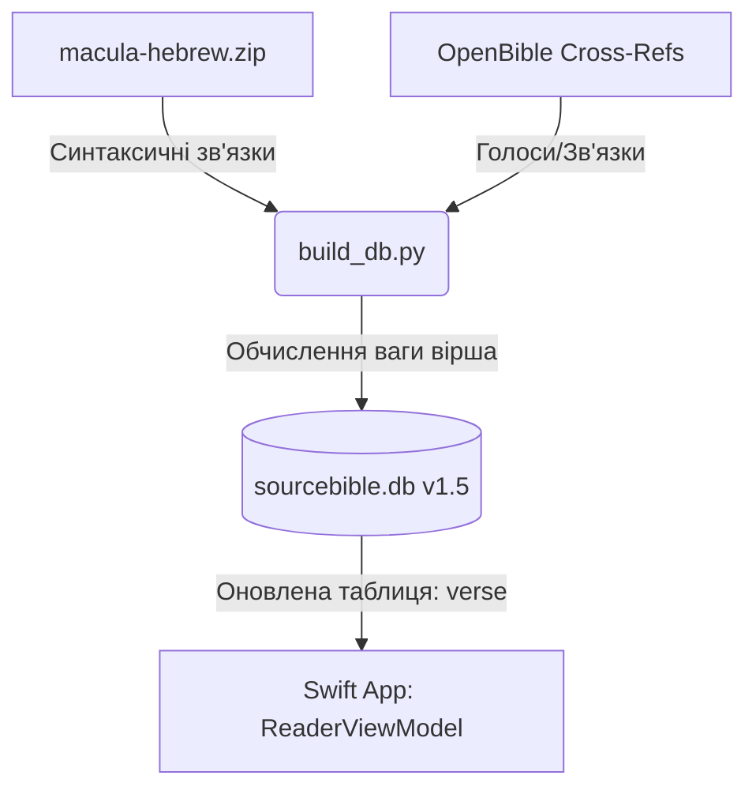

# Технічна пропозиція v1.5: Інтелектуальний вибір текстових прикладів (Smarter Example Selection)

Цей документ описує архітектурне та технічне рішення для оновлення **SourceBible v1.5**. Замість простого виведення першої хронологічної згадки слова (яка часто є неінформативною або зустрічається в генеалогіях), пропонується впровадити алгоритм **Smarter Example Selection**, що обирає вірші з найбільшою теологічною, риторичною та синтаксичною вагою.

---

## 1. Концепція та сигнали ваги (NLP Signals)

Для визначення «найкращого» вірша-прикладу система використовує два основні джерела даних:

### Сигнал А: Риторично-Теологічна вага (Cross-Reference Popularity)
Використовує таблицю `cross_reference` та поле `votes` (з OpenBible.info).
* **Ідея:** Вірші, які мають велику кількість перехресних посилань з високими оцінками (голосами), є ключовими ідейними та теологічними центрами Біблії.
* **Результат:** Замість сухого уривка додаток покаже відомий, глибокий за змістом вірш (наприклад, Псалом 23:1 *«Господь — мій пастир»* замість Псалма 1:2 для слова *«Господь»*).

### Сигнал Б: Синтаксична вага слова (Macula Dependency Tree Centrality)
Використовує дерева залежностей Macula (структура XML `lowfat` файлів).
* **Ідея:** Слово має більшу синтаксичну вагу, якщо воно є ядром фрази або речення (має високий показник *Degree Centrality* — тобто від нього залежить багато інших слів).
* **Результат:** Пріоритет надається реченням, де цільове слово є головним підметом або присудком, а не другорядним членом у складному звороті.

---

## 2. Архітектура оновлення бази даних (sourcebible.db)

Щоб уникнути важких обчислень на мобільних пристроях у реальному часі, вага віршів розраховується під час збирання бази даних за допомогою скрипту `build_db.py`.



### Зміни в схемі БД:
До таблиці `verse` додається колонка `rhetorical_weight` (риторична вага):
```sql
ALTER TABLE verse ADD COLUMN rhetorical_weight INTEGER DEFAULT 0;
```

> [!NOTE]
> Значення `rhetorical_weight` вираховується як сума всіх `votes` із таблиці `cross_reference`, де цей вірш виступає як джерелом (`from_verse`), так і ціллю (`to_verse`).

---

## 3. Алгоритм вибору прикладів у додатку (Swift)

Коли користувач відкриває вкладку слова (наприклад, для Strong `H3068`), додаток робить швидкий запит до бази даних, який сортує вірші за вантажністю:

### SQL-запит для отримання найкращого прикладу:
```sql
SELECT v.book_id, v.chapter, v.verse, v.text 
FROM word w
JOIN verse v ON w.book_id = v.book_id AND w.chapter = v.chapter AND w.verse = v.verse
WHERE w.strongs_id = 'H3068' AND v.translation = 'KJV'
ORDER BY v.rhetorical_weight DESC
LIMIT 1;
```

> [!TIP]
> Якщо для якогось рідкісного слова всі доступні вірші мають `rhetorical_weight = 0` (немає перехресних посилань), алгоритм автоматично переходить на синтаксичний сигнал (обирає вірш, де слово має роль головного підмета `s` чи присудка `v`), або робить fallback до першої хронологічної згадки.

---

## 4. Переваги для користувача (UX Benefits)

1. **Миттєве розуміння контексту:** Користувач бачить слово у вірші, який він, скоріш за все, уже знає напам'ять, що допомагає швидше асоціювати значення.
2. **Якісна типологія:** Візуальне відображення прикладів виглядає набагато професійніше та позбавлене випадкового «сміття» з переліків імен чи географічних описів.
3. **Висока продуктивність:** Оскільки вага проіндексована в БД, вибірка відбувається за **< 5 мілісекунд** без навантаження на батарею пристрою.
